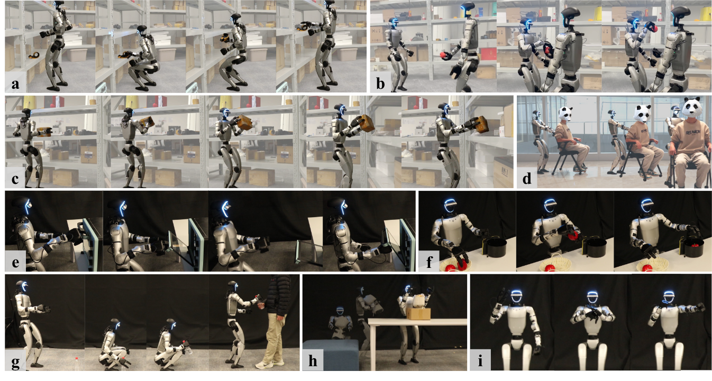

<br>
<p align="center">
<h1 align="center"><strong>HOMIE: Humanoid Loco-Manipulation with Isomorphic Exoskeleton Cockpit (RL)</strong></h1>
  <p align="center">
    <a href='https://www.qingweiben.com' target='_blank'>Qingwei Ben*</a>, <a href='https://trap-1.github.io/' target='_blank'>Feiyu Jia*</a>, <a href='https://scholar.google.com/citations?user=kYrUfMoAAAAJ&hl=zh-CN' target='_blank'>Jia Zeng</a>, <a href='https://jtdong.com/' target='_blank'>Junting Dong</a>, <a href='https://dahua.site/' target='_blank'>Dahua Lin</a>, <a href='https://oceanpang.github.io/' target='_blank'>Jiangmiao Pang</a>
    <br>
    * Equal Controlbution
    <br>
    Shanghai Artificial Intelligence Laboratory & The Chinese University of Hong Kong
    <br>
  </p>
</p>

<div id="top" align="center">

[](https://arxiv.org/abs/2502.13013)
[](https://homietele.github.io/)
[](https://www.youtube.com/watch?v=FxkGmjyMc5g&feature=youtu.be)
<!-- []() -->


## 🤖 [Demo](https://www.youtube.com/watch?v=FxkGmjyMc5g&feature=youtu.be)

[]()

</div>


## 🔥 News

- \[2025-02\] We release the [paper](https://arxiv.org/abs/2502.13013) and demos of HOMIE.
- \[2025-02\] We open all of the resources of HOMIE

## 📋 Contents

- [🏠 About](#-about)
- [🔥 News](#-news)
- [📚 Usage](#-usage)
- [📝 TODO List](#-todo)
- [🔗 Citation](#-citation)
- [📄 License](#-license)
- [👏 Acknowledgements](#-acknowledgements)

## 🏠 About

<a name="-about"></a>
This repository is an official implementation of "HOMIE: Humanoid Loco-Manipulation with Isomorphic Exoskeleton Cockpit", which is a novel humanoid teleoperation cockpit composed of a humanoid loco-manipulation policy and an exoskeleton-based hardware system. 

HOMIE enables a single operator to precisely and efficiently control a humanoid robot's full-body movements for diverse loco-manipulation tasks. Integrated into simulation environments, our cockpit also enables seamless teleoperation in virtual settings. Specifically, we introduce three core techniques to our RL-based training framework: upper-body pose curriculum, height tracking reward, and symmetry utilization. These components collectively enhance the robot's physical agility, enabling robust walking, rapid squatting to any required heights, and stable balance maintenance during dynamic upper-body movements, thereby significantly expanding the robot's operational workspace beyond existing solutions. Unlike previous whole-body control methods that depend on motion priors derived from motion capture (MoCap) data, our framework eliminates this dependency, resulting in a more efficient pipeline. 

Our hardware system features isomorphic exoskeleton arms, a pair of motion-sensing gloves, and a pedal. The pedal design for locomotion command acquisition liberates the operator's upper body, enabling simultaneous acquisition of upper-body poses. Since the exoskeleton arms are isomorphic to the controlled robot and each glove has 15 degrees of freedom (DoF), which is more than most existing dexterous hands, we can directly set upper-body joint positions from the exoskeleton readings, dispensing with IK and achieving faster and more accurate teleoperation. Moreover, our gloves can be detached from the arms, allowing them to be reused in systems isomorphic to different robots. The total cost of the hardware system is only \$0.5k, which is significantly lower than that of MoCap devices.

This repository contains three key components of HOMIE:

* **HomieRL**: A novel reinforcement learning (RL)-based training framework that enables different kinds of humanoid robots to walk and squat robustly under any continuously changing upper-body poses.
* **HomieHardware**: It contains all necessary files to reimplement our hardware system, including design files, PCB principle files, and keil code for PCBs. (You are required to fill in a form to get such resources. NOTE: Please make sure that you use your actual name and actual institution when filling the form. People without a valid name or institution will not be considered as appropriate to have access to the resources in order to protect our knowledge priviledge. Individuals without any institutions may contact the authors directly.)
* **HomieDeploy**: It contains all deployment code for both PC that connected to our hardware system and the Unitree G1 with Dex3 hands.

We separate these parts into three different sub-directories, you can view them as three independent repositories. Each sub-directory has its own README, which describes their usage ways and functions. HOMIE is fully open-sourced, however, ***it is strictly forbidden to use HOMIE for any commercial purposes***.

## 📚 Usage
<a name="-usage"></a>

### Prerequisites

We recommend to use our code under the following environment:

- Ubuntu 20.04/22.04 Operating System
- IsaacGym Preview 4.0
  - NVIDIA GPU (RTX 2070 or higher)
  - NVIDIA GPU Driver (recommended version 535.183)
- Conda
  - Python 3.8
- Hardware
  - Unitree G1 with Dex3 Hands
  - Realsense D455 * 1
  - Realsense D435 * 2
### Installation
You should first clone this repository to your Ubuntu computer by running:
```
https://github.com/OpenRobotLab/Homie.git
```
Then you can follow the README.md in each sub-repostory to install all three parts or just one of them.

If you have any questions about the usage of this repository, please feel free to drop an e-mail at **elgceben@gmail.com**, we will respond to it as soon as possible. Or, you can join our discussion wechat group:


## 🔗 Citation

If you find our work helpful, please cite:

```bibtex
@article{ben2025homie,
  title={HOMIE: Humanoid Loco-Manipulation with Isomorphic Exoskeleton Cockpit},
  author={Ben, Qingwei and Jia, Feiyu and Zeng, Jia and Dong, Junting and Lin, Dahua and Pang, Jiangmiao},
  journal={arXiv preprint arXiv:2502.13013},
  year={2025}
}
```

</details>

## 📝 TODO List

- \[x\] Release the paper with demos.
- \[x\] Release all necessary code.
- \[ \] Release training code for more robots.
- \[ \] Upgrade the low-level control policy for more complex terrains and more robots.

## 📄 License

All code of HOMIE is under the <a rel="license" href="http://creativecommons.org/licenses/by-nc-sa/4.0/">Creative Commons Attribution-NonCommercial-ShareAlike 4.0 International License </a><a rel="license" href="http://creativecommons.org/licenses/by-nc-sa/4.0/"></a>. It is strictly forbidden to use it for commercial purposes before asking our team.

## 👏 Acknowledgements


- [RSL_RL](https://github.com/leggedrobotics/rsl_rl): We use `rsl_rl` library to train the control policies for legged robots.
- [Legged_gym](https://github.com/leggedrobotics/rsl_rl): We use `legged_gym` library to train the control policies for legged robots.
- [HIMLoco](https://github.com/OpenRobotLab/HIMLoco): We use `HIMLoco` library as our codebase.
- [Walk-These-Ways](https://github.com/leggedrobotics/rsl_rl): Our robot deployment code is based on `walk-these-ways`.
- [Unitree SDK2](https://github.com/leggedrobotics/rsl_rl): We use `Unitree SDK2` library to control the robot.
- [HomunCulus](https://github.com/nepyope/Project-Homunculus): Our glove design refers to the principle of `HomunCulus` such as using `Hall sensors`.
